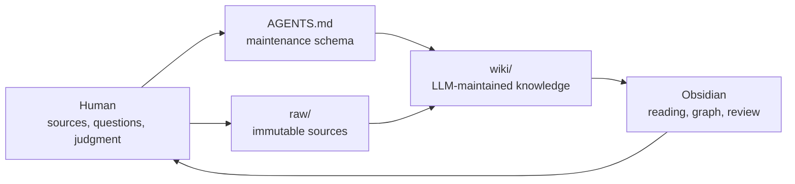
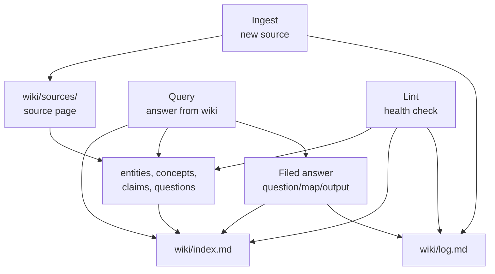

# Knowledge Base Architecture

## Three Layers

## Operations

## Design Notes

- `raw/` protects provenance.
- `wiki/` accumulates synthesis.
- `AGENTS.md` keeps future LLM sessions disciplined.
- `wiki/index.md` is the first navigation surface.
- `wiki/log.md` preserves the history of how the wiki evolved.

